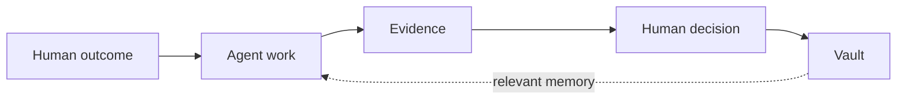

# Brother

**AI agents can do the work. Brother makes them prove it, and remembers what it proved.** Every delivery ends in a receipt you can rerun. Every install carries a Vault: the plain Markdown memory of what broke and what was learned, kept with the install.

Brother is the control layer for autonomous software development. Give it an outcome. Brother helps agents move the work forward, checks what actually happened, keeps useful project memory in the Vault, and leaves the decisions that carry weight with humans.

**Work. Prove. Remember. Decide.**

## Why Brother exists

AI coding agents can work for longer, touch more files, and make more decisions without constant supervision.

That is useful. It also creates a trust problem.

The same agent that writes the code can confidently explain why its own work is correct. A clear explanation is helpful, but it is not independent evidence.

Brother does not distrust autonomy. **Brother distrusts self-certification.**

The agent can inspect, plan, edit, test, and continue. The repository, the checks, and the recorded state decide what is actually known. A person keeps authority over the decisions that carry real weight.

Brother is built around five rules:

- Work is not proof.
- Confidence is not evidence.
- Unknown is not a pass.
- Memory is not truth.
- Autonomy is not authority.

## What Brother does

### Work

Tell Brother what should be true when the work is finished.

Brother can break the outcome into smaller units, move the work forward, keep durable state, and continue after an interruption. You do not need to choose an internal workflow before you begin.

### Prove

An agent saying `done` is a claim, not proof.

Brother checks the result against the repository and the evidence produced after the relevant change. It keeps three honest outcomes:

- **PASS** when evidence supports the claim.
- **FAIL** when evidence contradicts the claim.
- **NO-DATA** when there is not enough evidence to decide.

Unknown does not become green because the agent sounds confident.

### Remember

Useful project knowledge should not disappear into chat history.

Brother's Vault preserves decisions, failures, constraints, assumptions, and approved lessons in plain Markdown. You can open it in Obsidian or any normal editor. Brother can bring relevant memory back when it matters again.

The Vault is not unquestionable truth. Memory can become stale or be wrong, so Brother treats it as context to evaluate. **Current evidence still wins.**

### Decide

Brother should remove repetitive supervision, not human accountability.

Reversible work can continue. Release, merge, destructive deletion, acceptance of material trade-offs, and other decisions that carry real weight remain human.

## How it fits together



1. **You define the outcome.** Plain language is enough.
2. **Agents do the work.** Brother keeps the work bounded and durable.
3. **Evidence checks the claim.** The agent does not grade itself. A check is re-run and its exit code decides, and the receipt says who wrote the check.
4. **Humans keep authority.** The result informs the decision but does not replace the person responsible.
5. **The Vault keeps what matters.** Future work can use the lesson without blindly obeying it.

Proof without memory repeats mistakes. Memory without proof preserves bad assumptions. Brother keeps both, but gives neither the right to replace human judgment.

## Install and try it

Brother currently ships as a Claude Code plugin.

```bash
claude plugin marketplace add https://github.com/khalilmaaouni/Brother.git && claude plugin install brother@brother
```

The output should carry these two phrases, one per line; they are exactly what the bundle's install smoke test greps for:

```text
Successfully added marketplace
Successfully installed plugin
```

Without a `claude` binary on PATH that smoke test does not pretend: it prints BLOCKED and exits 2.

That single line was proven on 2026-09-03 by a fresh run of the bundle's install smoke test: exit 0, the bundle plus brothermode 3.4.4 and brothersbe 3.7.3 installed, and uninstalled clean.

Brother runs inside Claude Code, so sign in to Claude Code first, just as you would for any Claude Code session, and have python3 and git available: the runner is a python3 script and the hooks call git. The toy run below also needs pytest, because the check its second piece runs is `python3 -m pytest`.

The install registers 46 slash entries (commands and skills): 2 for the bundle door, 30 from brothermode and 14 from brothersbe, listed in `bundle/MANIFEST.json`. Its hooks run in every Claude Code session on the machine, whatever repository is open: at session start and end, when a turn stops, before context compaction, before edits and shell commands, and after shell commands. They call git and python3 locally and read and write their own state files (under your Claude config directory, inside the open repository, and in the Vault once set up); before compaction they snapshot the working tree into a private local git ref; and they can refuse an edit or shell command that crosses a file fence, refuse a shell command that would start a fifth concurrent Claude Code session, and hold a session open at stop until writes outside a declared scope are reconciled. They never use the network and never push.

Real work integrates into your repository. A run refuses to start only when uncommitted changes overlap the paths it will write; other uncommitted changes are left where they are, the run says so, and nothing merges into your tree until they are committed, so committing or stashing first is the simplest path.

Brother reads your request, written in plain words, and asks a question first only when the outcome is genuinely ambiguous. Before anything is claimed or run, its intent screen lists each piece of work with the check that will decide it and asks one thing: is this the outcome you meant, and are these the checks that should decide it? A run whose pieces touch encoding, auth, a migration, money, something irreversible, or a public API also leaves a release screen at the end for a person to answer.

Open Claude Code in the repository you want to work on and describe the outcome:

```text
/brother add rate limiting to the public API without changing existing client behaviour
```

Use a bare command to continue unfinished work or ask what to do next:

```text
/brother
```

On a fresh install this answers "no unfinished run found" and then asks what you are trying to do, so you can tell the first run is working.

For real work, Brother plans the pieces with a model. It then runs coding-model workers in separate git worktrees, with edits auto-accepted inside those worktrees, and integrates the pieces one at a time. It keeps its run state under `~/.claude/brother-run`. The check that proves each piece of work is written by the planning model unless a person edits it at the intent screen, so Brother proves the check ran and reproduced, never that it was the right check to ask for. That pause is opt-in: `/brother` runs the engine without `--interactive`, so by default the run records the top-ranked option (Proceed as decomposed) as a recorded default and says so in its output and the run log; pass `--interactive` or set `BROTHER_INTERACTIVE=1` to have it wait for a live answer at the intent screen. A check that already passes before the work, or a piece that changed no file, is reported NO-DATA, not delivered, and every receipt names who wrote its check.

### What a finished run gives you

A stranger can reproduce one receipt on a throwaway repository with three commands:

```bash
git init toy && cd toy
printf 'def add(a, b):\n    return a + b\n' > mathlib.py && printf 'import mathlib\n\n\ndef test_add():\n    assert mathlib.add(1, 2) == 3\n' > test_mathlib.py && git add -A && git commit -q -m "add() and its test"
/brother make add() refuse non-numeric input with a clear error and cover it with a test
```

This is that exact run's delivery report, pasted byte for byte from the run's own transcript, with only machine paths shortened to `~`:

```text
brother_run: delivery report for 'make add() refuse non-numeric input with a clear error and cover it with a test'
  work_id: W-make-add-refuse-nonnumeric-input-with-a-
  canonical revision before: 4190f9aece5209703888ad5c6fa0b5662d977caa
  canonical revision after:  63855a8b385204e03b306d64c9e38c7a4380a9bf
  files changed (2): mathlib.py, test_mathlib.py
  integrated (2):
    guard      verified by: python3 -c "import mathlib; assert mathlib.add(1,2)==3 and mathlib.add(1.5,2)==3.5" && python3 -c "import mathlib; mathlib.add('a','b')" 2>&
    test       verified by: python3 -m pytest test_mathlib.py -q -k 'type or numeric or error or raise'
  refused (0):

  what this run proved, one line per piece of work:
    guard delivered: the check python3 -c "import mathlib; assert mathlib.add(1,2)==3 and mathlib.add(1.5,2)==3.5" && python3 -c "import mathlib; mathlib.add('a','b')" 2>&1 | grep -q '^TypeError: .' was run and exited 0, and its full output is in ~/.claude/brother-run/docs/plan/runs/20260903T071356-make-add-refuse-non-numeric-input-with-a/run.log. Check written by the planning model, harness 015760192728. verdict: PASS
    test delivered: the check python3 -m pytest test_mathlib.py -q -k 'type or numeric or error or raise' was run and exited 0, and its full output is in ~/.claude/brother-run/docs/plan/runs/20260903T071356-make-add-refuse-non-numeric-input-with-a/run.log. Check written by the planning model, harness 015760192728. verdict: PASS

  exit 0 means no check failed. It does not mean everything is proven: only the checks named above ran, and a check nobody wrote cannot fail.

  cost:
    tokens_in: NO-DATA: no worker in this run recorded tokens_in
    tokens_out: NO-DATA: no worker in this run recorded tokens_out
    tokens_cached: NO-DATA: no worker in this run recorded tokens_cached
    turns: 2
    wall_clock_seconds: 1516.606818
    cache_hit_rate: NO-DATA: cannot compute a cache hit rate without real tokens_in and tokens_cached, which this run did not record
    failure_category: none
    harness_version: v3.4.2-2601-g01576019
    harness_revision: 015760192728a32c5055cd7dd741f7d3a3522d0b

  verdicts: 2 PASS, 0 FAIL, 0 NO-DATA
```

The engine at that revision (015760192728a32c5055cd7dd741f7d3a3522d0b) cut the summary line's check at 140 characters, fixed at the current revision, which is why the guard line above stops mid command; the whole check is the one on the "guard delivered" line further down.

Local run on one developer machine, not CI; the checks were written by the same model that wrote the code, and of the two only the guard check fails before the change and passes after, so this run proves the guard, not the test. The report also printed a second unit and a verdicts line reading 2 PASS, and the estate's own evidence audit refused to let that line stand here because the test unit's check passes with the guard deleted; Brother shows you the receipts, an audit decides what they prove.

This two-piece change took twenty-five minutes end to end on a loaded machine, and the same outcome took eight minutes on a quiet one earlier that day; a piece whose check keeps failing is retried up to three times at up to fifteen minutes each before the run gives up on it.

Acceptance is yours: the run recorded none, and Brother never accepts on your behalf. Each completed run writes an acceptance screen at `~/.claude/brother-run/docs/plan/runs/<run>/screens/acceptance-screen.html` and names it in the report; a person records the decision afterwards with the shipped `loom.py answer --screen acceptance` command, under their own name and time, and there is no default acceptor. This repository keeps its own acceptance records under `docs/deliveries`, written by the team rather than by the run, and the toy run above has one there. Each record names whether a person or an agent under a named delegation typed it, and only a person's recorded acceptance counts toward the acceptance rate.

The run's own log is under `~/.claude/brother-run/docs/plan/runs/<run>/run.log`.

Update and uninstall are each one command too, and here is what each leaves behind:

```bash
claude plugin update brother
```

updates to the latest published version and leaves nothing extra behind; a restart of Claude Code applies it.

```bash
claude plugin uninstall brother && claude plugin marketplace remove brother
```

removes the plugin and then the marketplace registration the install line added. What stays after that is only what your own use created inside your repositories, plus the run state Brother kept at `~/.claude/brother-run`, plus any `brother-lane-` worktree directory a killed run left under the system temp directory (a run that finishes removes its own, and `git worktree prune` in your repository forgets a dead one); remove the run state too with `rm -rf ~/.claude/brother-run` if you want nothing left.

## When Brother is useful

Use Brother when the work is large enough, long enough, or important enough that an agent's completion message is not sufficient.

Typical examples include:

- a feature that spans several files;
- a bug with an uncertain cause;
- a change to authentication, money, data, contracts, migrations, concurrency, or production behaviour;
- work that may continue across sessions;
- a project where previous decisions and failures should influence future work.

Skip Brother for an obvious, reversible edit you can make and check in under a minute. The goal is accountable autonomy, not ceremony on every line.

## What Brother is not

Brother is not another model and it is not a replacement for engineering judgment.

It does not make agents infallible. It does not make weak checks strong. It does not turn old memory into truth. It does not release or merge on behalf of the person accountable for the result.

It makes the boundary clearer:

> **Agents can act. Evidence decides what we believe. Humans decide what carries weight. Memory helps the next run.**

## Find your path

| You want to | Start here |
| --- | --- |
| Use durable project memory | [Use the Vault](docs/how-to/USE-THE-VAULT.md) |
| Understand why the Vault is part of the product | [The Vault](docs/explanation/VAULT.md) |

More task and concept pages are on the way; the documentation set is being rebuilt page by page under a strict one-page-one-job rule, and pages appear here only once they exist.

## For maintainers: what this repository enforces about itself

There is no headcount cap on skills, commands, agents or hooks here. The caps this
project once stated were WITHDRAWN on 2026-08-22, along with the refusal policy that
depended on them; `docs/CHARTER.md` records the withdrawal. That withdrawal is stated
here rather than left implicit because a rule is not a control unless a file enforces
it, and `tests/test_surface.py` no longer counts anything against a number. It checks
shape instead: the licence, no self-firing continuous-integration workflow, that the
marketplace catalogs plugins each installable on their own, and that the coordination
document names the architecture decision it follows. Where it cannot reach a verdict it
says so rather than passing.

What holds in place of a cap is the surface rule itself: no existing command is
renamed, and no new public command lands without a deliberate decision to add one. That
is the same restraint that keeps `/brother` the one entry point, written down where a
maintainer will look for it.

## License

MIT. See [LICENSE](LICENSE).
