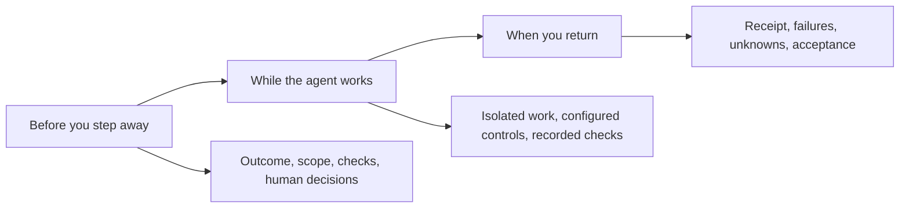
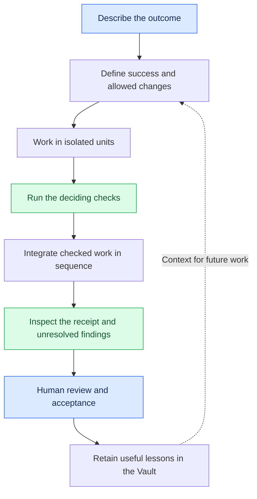
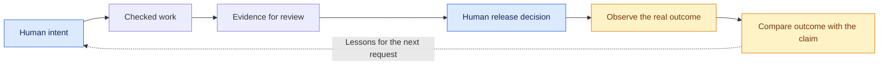
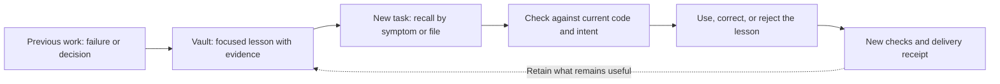

# Brother

### Let AI work. Give it boundaries. Make it earn your trust.

**When AI says done, Brother gives you proof.**

You want to give an AI agent a task and get on with your day. But full auto asks for more trust than you can justify, and watching every action turns you into the agent's full-time supervisor.

**Brother is built for autonomy you can justify:** agreed boundaries before the work, checks during execution, and an auditable record when you return. It is a plugin for Claude Code and Codex that connects scoped execution, verification, delivery evidence, and local memory.

The goal is to let you step away for more useful work as the system earns confidence through a track record you can inspect. Current protection depends on the installed controls, the task, and the quality of its checks; Brother is not a blanket guarantee that any job is safe to leave unattended.

[The problem](#why-brother) · [Who it is for](#who-brother-is-for) · [Why this approach](#what-makes-brother-different) · [The Vault](#the-vault-remember-the-lesson-not-just-the-conversation) · [Get started](#start-in-sixty-seconds) · [Documentation](docs/README.md)

**Start small:** [install for your host](docs/reference/install-matrix.md), [try a verified change](docs/tutorials/first-verified-change.md), then use the [delegation checklist](docs/how-to/delegate-safely.md) before increasing autonomy. Already using another workflow? Read [Where Brother fits](docs/explanation/choosing-a-workflow.md).

## Why Brother?

**The problem is the trust gap between “it can do the work” and “I can leave it alone.”**

You assign a task, then keep checking the terminal. You approve routine steps, scan a growing diff, and wonder whether the agent is still solving the right problem. Turn off the interruptions and the uncertainty remains: did it exceed its scope, weaken a test, repeat a failed approach, or declare success without evidence?

Watching can catch mistakes, but watching is not an enforced boundary. A log can show what happened without preventing it. A stream of approvals can consume your attention without establishing that the result is correct. And an overnight run is not a productivity win if you spend the morning reconstructing and repairing it.

Brother's approach is to define the delegated work, constrain its execution through the available controls, verify its claims, and leave a record that makes the result reviewable. The human's role is to set intent and make consequential decisions; the system should carry the routine checking that makes delegation possible.

| What you need | What Brother brings |
| --- | --- |
| Confidence before stepping away | An explicit outcome, allowed changes, and deciding checks |
| Limits on autonomous work | Isolated execution and scope controls, with enforcement dependent on setup |
| Verification while work proceeds | Recorded check results and visible failures or missing evidence |
| A reviewable result on return | A receipt connecting changed files, commands, results, and unresolved findings |
| Confidence that can grow over time | Rerunnable records and measurement protocols, with gaps disclosed |
| Authority over consequential decisions | Human review, acceptance, and release decisions |

**The ambition: more useful work completed while you are away, with less uncertainty when you return.**

### “I want to delegate, but I cannot stop watching.”

Brother moves the trust question upstream: what may the agent change, what would demonstrate success, and which decisions remain yours? During execution, the configured controls and checks provide evidence about those boundaries. On return, the delivery record gives you a basis for acceptance.

That is the intended shift from continuous supervision to bounded delegation and evidence-based review. Whether it actually saves attention must be measured; adding more logs or approval prompts alone does not establish that benefit.

### “It says done. Now I have to check everything myself.”

A summary is useful, but it does not show which command ran against which change. Brother records the changed files, deciding commands, exit codes, and evidence in a receipt. That gives a reviewer a concrete starting point: inspect the checks, rerun them, and identify the parts that still need attention.

The benefit is traceability. It does not remove your responsibility to judge whether the checks are sufficient.

### “The tests passed, but they did not test the thing I asked for.”

Suppose you ask an assistant to reject invalid input. A test that only checks valid input can stay green before and after the change. Brother examines whether the deciding check distinguishes the claimed behavior. An already-green check, an unchanged implementation, or a check that remains green when its claimed dependency is reverted can lead to `NO-DATA`.

You can see the gap between “a command succeeded” and “this behavior was demonstrated.”

### “Every new session starts with explaining the project again.”

Brother can discover unfinished work and resume it by its outcome. Its local Vault can retain lessons, constraints, decisions, and failed approaches that are useful later. This gives subsequent work a place to recover context beyond the current conversation.

Memory is still subject to checking. A recalled lesson cannot override current code, current evidence, or your decision.

### “A small request became a sprawling change.”

For substantial implementation work, Brother divides the outcome into bounded pieces. Each declares what it is trying to accomplish, what files it may change, how it will be checked, and what it depends on. Independent pieces can run separately; the results are integrated in sequence.

That makes the scope and dependencies inspectable before you accept the combined result. Tiny reversible tasks can stay outside this process.

### “I need to hand this over, not hand over my entire chat.”

Brother brings the evidence into the delivery record: what changed, what ran, what the results support, and what remains unknown. A teammate or your future self can start from that record and follow the evidence instead of treating a confident closing message as the source of truth.

## Who Brother is for

Brother is for people who want to delegate meaningful work to an agent but cannot justify unrestricted full auto. Its strongest fit is work in repositories where scope and success can be made explicit and checked. The aim is to make stepping away a reasoned decision, supported by the task's controls and evidence.

| User | A familiar problem | How Brother helps | What you still own |
| --- | --- | --- | --- |
| **Developers and solo builders** | You want a feature built while you focus elsewhere, but keep checking the agent | Define the behavior, bound the edits, and retain checks with the change | Product intent, sufficient test coverage, and the decision to ship |
| **Backend and data engineers** | A schema or pipeline change might break consumers you did not touch | Bring migration, rollback, and downstream evidence into the review | Identifying real consumers and providing a representative test environment |
| **Analysts and technical business analysts** | A number reaches a decision without a traceable derivation | Connect the reported figure to source data, calculations, and reconciliation evidence | Business definitions, source quality, and interpretation |
| **QA engineers and reviewers** | “All tests pass” hides which requirements were actually checked | Inspect the commands and distinguish supported claims from missing evidence | Independent expected results and additional checks where needed |
| **Technical leads and delivery owners** | Running more agents multiplies the work of supervising them | Use bounded outcomes, resumable work, and delivery evidence to assess delegation | Priorities, acceptance, and release authority |

You do not need to learn the internal product names to begin. Describe the work through Brother's entry point. For role-specific examples, see the [professional guides](docs/README.md).

### When to use something simpler

If you are exploring an idea, asking a question, or making an obvious reversible edit, the full execution process may add more work than it saves. Brother is designed to scale the checking to the task, and to stay out of trivial work. It also needs access to the relevant code, data, or test environment to substantiate a claim; missing access cannot be repaired by better wording.

## What makes Brother different

**Not another promise that agents can code. A way to decide which work deserves your trust.**

Brother's distinctive emphasis is the connection between these mechanisms, not a claim that nobody else has tests, memory, or isolated workers:

| Differentiator | What you get | The limit that matters |
| --- | --- | --- |
| **Evidence tied to the change** | A durable receipt naming files, exact checks, results, and unresolved claims | A receipt cannot make a weak test sufficient |
| **Checks that must distinguish the behavior** | Already-green and revert-insensitive checks can be marked `NO-DATA`, rather than sold as proof | This tests relevance, not complete specification coverage |
| **Bounded execution, then serial integration** | Declared write scopes and dependencies, isolated work where available, checked results brought together in order | Host controls and effective safety mode determine enforcement |
| **The Vault at the point of work** | Retrieve a past failure by its symptom, file, or linked lesson before repeating it | Recall is fallible context, never permission or current proof |
| **Continuity beyond the chat** | Resume an unfinished outcome and inspect a saved delivery record | State must remain available; not every failure is automatically repairable |
| **Authority separate from evidence** | A visible distinction between checked work, human acceptance, and release | You still own requirements, consequential decisions, and shipping |

The intended loop is simple: **delegate within a boundary, inspect what happened, remember what mattered, and earn the next increment of autonomy.** Start with [what is enforced and what is not](docs/reference/safety-boundaries.md). For source-level detail, see the generated [system map](SYSTEM.md).

## How it works

The delegation model has three stages: agree the boundaries, execute with the configured checks and controls, then review the evidence. Start with narrow tasks and inspect the results before trusting the same setup with larger ones.



For substantial changes, Brother turns your request into bounded work with explicit checks, brings the results together, and records the evidence for your review.



Independent work can proceed separately; integration happens in sequence. Failed checks and missing evidence remain visible. The receipt supports your decision; it does not authorize a deployment or accept the result for you.

### 1. Describe the result, including what must stay true

Start with the outcome you need, rather than a list of tools to invoke. For example: “Reject non-numeric input, keep valid additions working, and show tests for both.” For work that needs a contract, intake records the original question, success checks, required answers, and relevant decision requirements.

This gives the plan a target to answer. A technically correct change can still be the wrong answer to the request.

### 2. Make the work and its checks explicit

Substantial work becomes units with an objective, allowed writes, dependencies, and a deciding command. The check is part of the definition of completion, rather than an explanation added afterward.

Risk-bearing work receives additional assurance. A migration needs different evidence from a UI change; a decision-grade figure needs its derivation. Brother routes the work accordingly.

### 3. Execute and inspect what the checks establish

The execution path isolates units and checks their results before serial integration. Brother records failures and cases where the evidence does not establish the claim. The question is not only whether a command returned zero, but whether that result supports the behavior being claimed.

### 4. Review the delivery with evidence attached

Read the receipt to see the files, commands, results, and unresolved findings. Rerun the relevant checks. Judge whether the evidence is enough for the decision in front of you. Review, acceptance, and release remain explicit human decisions.

### 5. Carry useful knowledge into the next task

Resume unfinished outcomes and retain useful lessons in the Vault. The aim is to make future work easier to orient and less likely to repeat known mistakes, while keeping recalled context subordinate to current evidence.

## An example: fix input validation without breaking valid requests

Imagine a function accepts two values. It adds numbers correctly, but also accepts strings. You want a clear error for invalid input and no change to valid behavior.

**Your request:**

```text
/brother make add() reject non-numeric input, preserve valid numeric addition,
and cover both behaviors with tests
```

**The work to make explicit:** which implementation and test files may change, what counts as invalid input, and which commands demonstrate both rejection and preserved behavior. If the requirement is ambiguous, that needs resolving before a test can act as the expected answer.

**The evidence to inspect:** a check that demonstrates invalid input is rejected, a regression check for valid input, and a receipt connecting those results to the files that changed. If the proposed rejection test already passed before implementation, its green result alone does not prove the fix.

**Your decision:** whether the examples and edge cases are sufficient for this function's callers. Brother gives you a record to review; it does not invent missing requirements or make that judgment for you.

This is an illustrative workflow. The first-run transcript below includes a real distinction between a verified implementation check and a test-file claim that remained `NO-DATA`.

## Trust is earned across runs

A successful demo is a starting point. A trustworthy autonomous workflow needs a track record: what tasks it attempted, what it completed, where a person intervened, what escaped the checks, and whether another reviewer can reproduce the result.

Brother's receipts make runs inspectable. **Auditable does not mean independently audited or certified.** This page does not claim an independent safety audit, a proven unattended success rate, or a measured reduction in supervision time.

Two measurement protocols make the ambition concrete:

| Measure | What it asks | Current limitation |
| --- | --- | --- |
| [Safe Unwatched Time](benchmarks/SAFE-UNWATCHED-TIME.md) | How much recorded work proceeds before a scope or evidence failure? | The instrument does not record human interventions, so its duration is an upper bound, not proof of unattended operation. It does not measure overall quality. |
| [Acceptance Time](benchmarks/ACCEPTANCE-TIME.md) | Can a competent reviewer reach the correct accept/reject decision faster from a receipt? | The protocol requires a human trial. This page claims no demonstrated improvement. |

The standard to earn is **longer useful autonomy, enforceable boundaries, recoverable failures, and a record that stands up to review**. Confidence should grow from representative runs and disclosed failures, not from a larger permission grant.

## The north star: autonomy that reaches verified reality

**The goal is to delegate more useful work without giving up control or losing the ability to verify the outcome.** Brother connects what you intended, what was built, the evidence used to accept it, and what happened after release. More time running unattended only matters if the work remains within its boundaries and the result holds up.



This is the governing direction, not a claim that every stage is automatic or proven for every task.

| Capability | The question it answers | Status |
| --- | --- | --- |
| **BrotherMode** | What work happened, and what checked it? | Execution provenance in the bundle |
| **BrotherSBE** | What evidence supports this change's readiness? | Change assurance in the bundle |
| **BrotherDS** | Did a decision-grade claim match its eventual outcome? | Experimental, outside the standard bundle |

The claims domain's Verified Claim Rate is currently `NO-DATA`: no resolved claims establish it yet. It is not a score for BrotherMode or BrotherSBE. See the [north star and evidence principles](docs/CHARTER.md).

## Your first run, start to finish

Start with a task whose expected result you understand. Inspect its receipt and rerun the checks before relying on Brother for broader work.

<details>
<summary>See a complete first-run example, including an unproven check</summary>

```text reference
mkdir mathlib-toy && cd mathlib-toy
git init -q
git config --local user.name "Toy User"
git config --local user.email "toy@example.invalid"
cat > mathlib.py <<'EOF'
def add(a, b):
    return a + b
EOF
cat > test_mathlib.py <<'EOF'
import mathlib


def test_add_ints():
    assert mathlib.add(1, 2) == 3


def test_add_floats():
    assert mathlib.add(1.5, 2) == 3.5
EOF
git add mathlib.py test_mathlib.py
git commit -q -m "toy mathlib, before the fix"
claude plugin marketplace add khalilmaaouni/Brother && claude plugin install brother@brother
/brother
no unfinished run found
Brother turns AI-assisted work into something checkable instead of just trusted. What are you trying to do right now: start or check on a project, or get a change proven safe before it ships?
make add() refuse non-numeric input with a clear error and cover it with a test
mathlib.py: check python3 -c "import mathlib; assert mathlib.add(1,2)==3 and mathlib.add(1.5,2)==3.5" && python3 -c "import mathlib; mathlib.add('a','b')" 2>&1 | grep -q '^TypeError: .' exited 0 (verified)
test_mathlib.py: check python3 -m pytest test_mathlib.py -q -k 'type or numeric or error or raise' exited 0 (NO-DATA: this check depends on guard, and its check was never re-run with that change reverted, so nothing shows the check exercises it)
brother_run: receipt: ~/.claude/brother-run/docs/plan/runs/20260903T071356-make-add-refuse-non-numeric-input-with-a/receipt/receipt.json
```

</details>

## Start in sixty seconds

### Claude Code

```bash reference
claude plugin marketplace add khalilmaaouni/Brother && claude plugin install brother@brother
```

The marketplace this repository declares is named `brother`, in lower case, whatever case the repository slug you added it from carries. Use that spelling everywhere a command names the marketplace: `claude plugin marketplace update Brother` answers `Marketplace 'Brother' not found. Available marketplaces: brother` and exits 1.

Open a repository and invoke Brother. With no unfinished work, the bare door asks what you are trying to do rather than making you choose BrotherMode, BrotherSBE, or another internal product.

```text
/brother make add() reject non-numeric input and prove the behavior with a test
```

If unfinished Brother work exists in that repository, the door should discover it and offer/resume the plain-language outcome instead of exposing a run id as the user experience.

### Codex

Codex does not expose Brother through Claude's slash-command surface. Install the Brother plugin, wire the supported managed hooks/trust path, then use the installed Brother skill or runtime engine. See [Install on Codex](docs/how-to/install-codex.md).

To upgrade an existing install, remove the configured marketplace first, then add it again at the new ref, joined so no step runs over a failed one:

```bash reference
codex plugin marketplace remove brother && codex plugin marketplace add https://github.com/khalilmaaouni/Brother --ref <new ref> && codex plugin add brother@brother --json
```

## Check what you installed

BrotherMode and BrotherSBE ship `CHECKSUMS.sha256` and `verify-install.sh`. In either product directory, `bash scripts/verify-install.sh` re-hashes files and compares them with the shipped manifest, and changes nothing. Do not run `sh scripts/checksums.sh CHECKSUMS.sha256` first, because it rewrites the manifest from the current bytes and makes a tampered file agree with a fresh manifest. Regenerating the manifest is the maintainer's step when cutting a release, never the reader's step before verifying.

The shipped engine has `RUNTIME-MANIFEST.json`: run `python3 bundle/runtime/verify_runtime.py` from this repository, or `python3 runtime/verify_runtime.py` from an installed plugin root. It prints PASS, FAIL with differing files, or NO-DATA when the manifest is missing. Its manifest is the reference, so rewriting both a file and its manifest line passes, and comparison with the published release tag is a different check.

## One door, three outcomes

1. **Trivial and reversible:** Brother stays out of the way. If nobody would reasonably ask for evidence afterwards, trust ceremony is waste.
2. **Substantial change:** Brother routes to execution provenance: bounded work, isolated execution, checks, serial integration, receipt.
3. **Risk or decision-grade truth:** Brother adds assurance appropriate to the risk. Money, authentication, customer/partner data, migrations, production paths, and decision-grade figures should not inherit confidence from one green command.

Claim verification is an experimental product boundary unless the current public release explicitly says otherwise.

## Bring the work that matters

These are example requests, not claims that a particular project has passed verification.

| Your task | Ask Brother |
| --- | --- |
| Build or fix a feature | “Reject invalid input, preserve existing behavior, and test both.” |
| Change a database | “Check this migration, including rollback and downstream reports.” |
| Explain a number | “Trace this weekly total to its source and show the reconciliation.” |
| Review a delivery | “Show what changed, which checks support it, and what is still unproven.” |
| Continue tomorrow | “Resume the unfinished work and show the next step.” |

## Evidence vocabulary

| Verdict | Meaning |
| --- | --- |
| `PASS` | The named evidence supports the named claim. |
| `FAIL` | The named evidence contradicts the named claim. |
| `NO-DATA` | The available evidence did not establish either answer. |

`NO-DATA` is not a weak pass. It is correct when the check was irrelevant, already passed before the change, could not run, did not exercise its claimed dependency, or otherwise failed to discriminate the claim.

A useful receipt lets a reviewer answer: **what changed, what check ran, what did it actually discriminate, where did the expected result come from, where is the evidence, and what remains unproven?**

## A green check can prove nothing

A command exiting zero after a change is not automatically evidence for that change. A useful check must discriminate. Brother should expose cases such as:

- the check already passed before work;
- a behavior-changing unit has no recorded pre-implementation nonzero run of its own deciding check. That missing red-before-green witness is `NO-DATA`; documentation-only and generated units state their exemption;
- a unit changed no relevant file;
- a test still passes after the implementation it supposedly exercises is reverted;
- a dependency was assumed but never tested in the relevant state;
- evidence output cannot be recovered;
- a model-authored check is presented as independent review when it is not.

Run the check that holds this rule in place: `python3 scripts/test_brother_run.py`. It proves that an already-green, unchanged, or revert-insensitive check is reported as `NO-DATA`, not evidence.

## Work stays bounded

Substantial work is represented as bounded work units. A unit declares its objective, deciding command, allowed writes, and dependencies. Work that escapes its write set is not quietly accepted. Independent units can work separately; integration is serial because the final repository must have one truth.

Local unit integration is not the same as approving a pull request, publishing a release, deploying production, or making the human acceptance decision.

## Intake comes before planning when the work needs a contract

A plan says how to build. It does not prove the plan answers what the person asked.

The current outcome contract records the original question, language, success checks, affected products, required answers, evidence receipts, audit/ticket requirements, lifecycle state, history, and decision reference. The schema is `docs/schema/outcome-contract-v1.json`.

The profession pages in this repository are **professional lenses**, not current schema enum values. See [Outcome contract reference](docs/reference/outcome-contract.md).

## Human authority stays visible

Brother can gather evidence and organize review. Evidence can inform authority; evidence is not authority. When acceptance cites a run, it requires a review receipt or an explicit recorded review skip with its reason and decision maker. Human acceptance and release remain explicit decisions.

## The Vault: remember the lesson, not just the conversation

An agent repeating last week's mistake is not autonomous in a useful sense. You are still its memory, reminding it which approach failed, why the migration is unusual, or what the business means by an active customer.

**The Vault is Brother's durable local knowledge layer.** Keep decisions, constraints, incident symptoms, failed approaches, semantic definitions, and useful test oracles. Retrieve the relevant lesson when a task or file needs it, rather than relying on a long opening prompt to stay in context.

For example, a previous change taught you that retrying a timed-out payment can charge twice. A useful lesson records the observable symptom, the idempotency constraint, the failed approach, the deciding test, and when the lesson no longer applies. On a later retry change, recall that lesson, inspect whether it still fits, and rerun the current check. This is an illustration, not a claim that Brother has verified your payment system.



The local retrieval tool combines lexical search, exact file/symbol anchors, and linked notes. Retrieval quality still needs checking: stale or irrelevant memory must not become a new source of confident mistakes. **The Vault remembers; the checks prove; you decide.**

It is not an automatic source of truth, a secrets store, or proof that repeat errors have decreased. Do not store credentials or raw customer data. Local storage also does not mean recalled content stays off the network: your coding host may send context to its model provider.

[Set up and exercise the Vault](docs/how-to/use-the-vault.md) · [Memory precedence and limits](docs/reference/vault.md)

## Questions a skeptical adopter should ask

**Is this just a bigger prompt?** It includes skills, but the execution path also has runtime checks, run state, scope handling, and receipt validation. Instructions and enforced controls are different things. The [boundary table](docs/reference/safety-boundaries.md) names that difference.

**Why not use tests and Git myself?** You should keep both. Brother connects them to a delegated outcome and a reviewable record. If that coordination saves less effort than it adds on your tasks, use the simpler workflow.

**Can the same agent write code and tests that agree on the wrong answer?** Yes. Recorded authorship is not independence. Bring expected results from requirements, existing regression cases, domain experts, or an independently written check. Read [evidence and independence](docs/reference/evidence.md).

**Can I leave it running overnight?** Not on the strength of this README. First verify the effective controls, use a narrow disposable task, inspect failure behavior, and keep consequential operations outside the delegation. Follow the [safe delegation guide](docs/how-to/delegate-safely.md).

**Is the reliability proven?** The repository includes executable checks and measurement protocols. That is not an independent audit, production certification, or proof that you can stop reviewing. The [track-record section](#trust-is-earned-across-runs) states the missing measurements.

**What if it fails while I am away?** Keep the run directory and worktrees, identify the failure, then resume the recorded outcome. Do not erase the evidence or loosen scope to get green. The [recovery guide](docs/how-to/recover-from-failure.md) gives the commands and decision points.

## Choose the shortest path

**Learn:** [Documentation home](docs/README.md) · [First verified change](docs/tutorials/first-verified-change.md) · [Why NO-DATA exists](docs/explanation/no-data.md)

**Do:** [Install Claude](docs/how-to/install-claude-code.md) · [Install Codex](docs/how-to/install-codex.md) · [Resume](docs/how-to/resume-work.md) · [Verify a migration](docs/how-to/verify-a-migration.md) · [Verify a number](docs/how-to/verify-a-number.md)

**Look up:** [Routing](docs/reference/routing.md) · [Outcome contract](docs/reference/outcome-contract.md) · [Verdicts](docs/reference/verdicts.md) · [Receipt](docs/reference/receipt-model.md) · [Work units](docs/reference/work-units.md) · [Hooks](docs/reference/hooks.md)

**Professional lenses:** [Senior backend](docs/personas/senior-backend-engineer.md) · [Senior data engineering](docs/personas/senior-data-engineer.md) · [Infrastructure/SRE](docs/personas/senior-infrastructure-engineer.md) · [Architect](docs/personas/architect.md) · [Data analyst](docs/personas/data-analyst.md) · [Data scientist](docs/personas/data-scientist.md) · [BA](docs/personas/business-analyst.md) · [Technical BA](docs/personas/technical-business-analyst.md) · [QA automation](docs/personas/qa-automation-engineer.md) · [Manual QA/QC](docs/personas/manual-qa-qc.md) · [Solo founder](docs/personas/solo-founder.md)

## Limits before adoption

- A receipt proves only the claims its evidence supports.
- A model-authored test is not automatically an independent oracle.
- Memory is not evidence.
- Tool exit success is not delivery proof.
- Claude Code and Codex have different host surfaces.
- Hook scope depends on install path/configuration; read [Hook scope](docs/reference/hooks.md).
- Tiny reversible tasks can still cost more through Brother than doing them directly, but not in every case any more: when a request already names its own existing file or files, and its own existing check written the one way Brother already knows how to run today (in the specific, narrow shape it already recognizes, not yet any test file in any framework), uses no risky wording, and the tree it runs against is already clean, Brother skips straight to doing the work and never opens a separate model session just to plan it, automatically, with nothing to turn on. Most everyday requests do not qualify, including one phrased only as plain instructions with no file or check named in it. Measured here with the model calls stood in by a script rather than a real one, so the figures below are Brother's own code and never a wait on a real model: four small requests were driven through the one command a person types, and all four finished successfully; the two that qualified opened no separate planning session at all, against one each for the two that did not, while Brother's own code took between 5.62 and 8.4 seconds either way. What a person waiting on a real model actually experiences from this is not recorded on this page.
- Exact version capability belongs in the public release and generated `SYSTEM.md`, not copied historical prose.

## Documentation is part of the evidence system

Current behavioral claims are registered in [DOC-CLAIMS.md](docs/assurance/DOC-CLAIMS.md). Public pages must not disagree silently.

**Tutorials teach. How-to guides solve tasks. Reference states the contract. Explanation gives reasoning. Persona pages apply the same evidence model to professional work.**

Start at [docs/README.md](docs/README.md).
