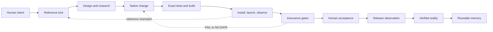

# Brother mobile architecture

This is the architecture of record for native mobile work across BrotherMode,
BrotherSBE and BrotherDS. It extends the existing eight-stage chain and six
verb router. It adds no public command, product, task registry or release
authority.

## One outcome, five boundaries

Every mobile outcome travels through one change passport and one receipt.
The passport carries intent, source revision, reference identity, design
decisions, assets, test scope, observations and acceptance state. The receipt
records what actually ran and what it proved.

| Boundary | Owner | Input | Output | Verdict |
| :-- | :-- | :-- | :-- | :-- |
| Intent and routing | Using Brother | Human outcome | Existing verb and scoped unit | Human decision |
| Execution | BrotherMode | Unit, source, tools | Changed files, commands, provenance | PASS, FAIL or NO-DATA |
| Assurance | BrotherSBE | Passport and evidence | Hard gate results | PASS, FAIL or NO-DATA |
| Native mobile | Mobile workflow component | Reference, profile, Xcode project | Tests, installed identity, capture, handoff | Technical verdict |
| Creative and design | Mobile design component | Curated screens, media and design intent | Ordered research, decisions, asset metadata | Evidence state |
| Verified reality | BrotherDS | Product or market claim | Observed outcome and uncertainty score | PASS, FAIL or NO-DATA |
| Human acceptance | Founder | Delivered build and observations | Accept, hold or request change | Human decision |

The mobile and creative components are execution support. They do not decide
whether a design is good, whether a market will pay, or whether a release
should ship.

## State machine

The reference lock precedes implementation. A recorded release mapping is
kept distinct from embedded source attestation. Ancestry is necessary but
does not prove behavioral parity. Design research is evidence only when its
source, observation date, flow position and media integrity are retained.

## Capability contracts

The native workflow requires a clean candidate that descends from the working
reference, an explicit project, scheme, target, configuration, simulator,
bundle identity and exact test identities. It runs tests into a fresh result
bundle, resolves the exact target product, verifies the installed plist and
executable, launches and captures, then checks the source again. A timeout
ends the process group before the native lease is released.

The design workflow accepts a locally curated board. Each screen has a stable
ID, app, title, flow, step, source, observation date, notes and elements.
Optional media is hashed. Search is local token and filter matching. A brief
leaves layout, state, motion, accessibility, iPad, asset and gamification
decisions unresolved until a person or a reviewed design unit makes them.
When the hosted catalog is unavailable, the free research catalog composes
public store metadata, public screenshots, platform guidance and local
captures. It records the missing proprietary market fields as NO-DATA rather
than treating a chart rank as revenue evidence.

Creative media has three destinations: runtime, marketing and prototype.
The media probe records file hash, streams, dimensions, duration and explicit
size or duration budgets. It does not certify rights, visual quality or app
runtime performance. Native interaction, timing, accessibility, haptics and
audio remain app evidence.

## Interchangeable harness adapters

External tools are adapters at the boundary, never the architecture itself.
Appllama can supply task-scoped screen and flow research. Xcode external-agent
access and XcodeBuildMCP can supply project and simulator operations. SwiftUI
skills can supply implementation review. Figma can supply design context.
Higgsfield, ComfyUI, Remotion, Rive, After Effects and Resolve can supply
creative assets or edits. Qwen, Kimi and other coding agents can be compared
on the same bounded unit. Every adapter must retain its inputs, version or
workflow, output hashes, access limits and a reproducible command where
available. An unavailable account or connector is NO-DATA, never silently
replaced by a claim of success.

The account-free fallback is defined in
`docs/architecture/MOBILE-FREE-RESEARCH-CATALOG.md`. It is a source adapter,
not a second architecture: its board manifest, source URLs, timestamps, media
hashes and limitations enter the same passport and receipt.

## Client continuity

Claude and Codex read the same source skill and generated runtime mirror.
Client-specific frontmatter remains in the generated Codex mirror boundary.
Both clients use the same unit fields, receipt contract, evidence vocabulary
and handoff archive. A handoff is portable when it contains the receipt,
profile summary, reference, result bundle, logs, captures and hashes. Rerun
still requires checkout of the source and available local tools.

## Scaling and ownership

One worker owns each declared file set. One native build and simulator lease
protects the local toolchain. Research, implementation and review can be
separate units, but they share the passport and receipt. A creative asset
cannot become a runtime dependency without an explicit native design decision.
An app screenshot cannot become a market metric without a dated source and
denominator. A green technical check cannot become human acceptance.

## Release and learning

Brother prepares the evidence. The founder decides release. TestFlight states
are recorded separately as uploaded, processing, available and installed.
Physical audio, haptics, VoiceOver, interruption behavior and visual feel need
their own observations. BrotherDS records product or market hypotheses with
uncertainty before measuring completion, helpfulness or return use. Missing
observation remains NO-DATA.

## Enforced now and deliberately open

The integration invariant is simple: every adapter must terminate in the same
passport and receipt, regardless of whether its input came from a hosted MCP,
an owned capture, an Xcode command or a creative render.

The existing key component registry, runtime manifest, native evidence guard,
mobile workflow guard, mobile design guard, skill portability check and
receipt-producing engine enforce the file and execution contracts. The
architecture does not claim a live Appllama connector, semantic catalog
search, automatic phone-to-source reconciliation, physical-device quality,
market success or cross-model superiority. Those become new evidence-backed
units when a real task requires them.
