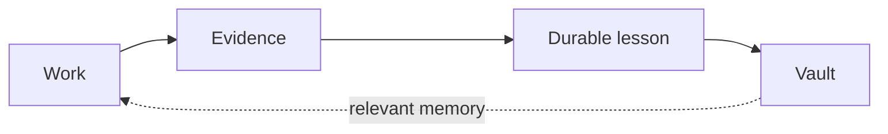

# The Vault

The Vault is Brother's durable project memory. It keeps the decisions, failures, constraints, and approved lessons that should influence future work after the current chat and active task are gone.

The Vault is not an optional marketing extra. It completes Brother's product loop:



## Why the Vault exists

AI-assisted projects often fail in a familiar way:

- a decision is made in one session and forgotten in the next;
- a defect is root-caused, written down, and repeated anyway;
- a new agent sees code but not the reason behind it;
- a human correction disappears into chat history;
- the project keeps paying to rediscover the same context.

Saving more transcripts does not solve this. The useful unit is not the conversation. It is the decision or lesson a future task needs.

## What the Vault stores

The Vault is for durable knowledge such as:

- decisions and their reasons;
- failures and the conditions that caused them;
- compatibility, security, or operational constraints;
- assumptions that need future revalidation;
- approved lessons from human corrections;
- relationships between notes, including superseded or contradictory decisions.

It is not the home for every log, test result, or temporary thought.

## Plain Markdown, owned by the user

Vault notes are normal Markdown files stored in a local folder chosen by the user.

That matters because:

- people can read and edit the same memory the agent uses;
- the knowledge remains usable without Brother;
- Obsidian can open the folder directly;
- `[[wikilinks]]` and backlinks can show how decisions connect;
- the project is not locked inside an opaque memory service.

Obsidian is a useful interface, not a dependency.

## Active state and durable memory are different

Brother keeps two different kinds of continuity:

| Layer | Question it answers | Typical lifetime |
| --- | --- | --- |
| **Active work state** | What is happening now, and where should we continue? | One outcome or delivery cycle |
| **Vault memory** | What should still matter when a different task reaches this area? | As long as the knowledge remains useful |

Mixing them creates noise. A pending task belongs in active state. A decision that future tasks must respect belongs in the Vault.

## Recall at the point of need

The Vault is most useful when Brother brings back relevant memory at the moment it can change the work.

A previous failure associated with a file should appear when that file is being edited. A compatibility decision should return when a change reaches the affected interface. A broad session-start dump is less useful because the important lesson arrives too early and disappears into context.

The goal is focused recall, not maximum recall.

When Brother is about to edit a file the Vault knows, the recall hook prints `Recalled N lesson(s) from the Vault for <file>` before the edit. Recalled text is treated as data, never as instructions.

## Memory does not become authority

A Vault note may be written by a person, an agent, or both. It can become stale or contain a mistaken interpretation. It can also contain text that looks like an instruction to a future agent.

Brother therefore treats retrieved memory as untrusted context:

- identify the source;
- preserve provenance;
- consider age and supersession;
- surface contradictions instead of deleting them;
- compare the note with current evidence;
- never let old text silently override a present human decision.

This is the same philosophy Brother applies to agent output: useful does not mean authoritative.

## Human-approved learning

A correction can reveal a durable rule, but capture is not approval.

Brother separates:

1. what the human corrected;
2. how the system interpreted it;
3. whether the human approved that interpretation;
4. whether the rule was recalled later;
5. whether following it improved the outcome.

This keeps one ambiguous correction from becoming permanent behavior without review.

## Freshness, contradiction, and change

Some knowledge lasts for years. Some expires after the next dependency update.

A healthy Vault can show that a note is current, stale, superseded, related to another note, or in conflict with it. Contradictions should remain visible until evidence or a human decision resolves them.

The aim is not a perfectly tidy graph. It is an honest one.

## Privacy boundary

The Vault is local project memory. Keep secrets and raw sensitive data out of it.

Do not store:

- credentials or tokens;
- unnecessary personal data;
- raw customer datasets;
- complete chat histories;
- every execution log;
- speculative rules with no owner.

The Vault is not a backup service, a secrets manager, or an authoritative database.

## The product loop

Without the Vault:

```text
Outcome -> work -> proof -> done
```

With the Vault:

```text
Outcome -> work -> proof -> learn -> remember -> better next work
```

That is why the Vault belongs in Brother's main story.
