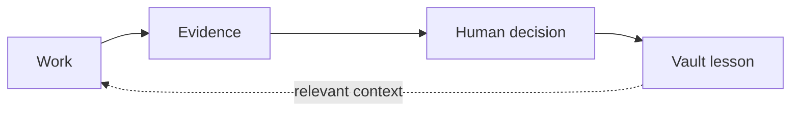

# The Vault

The same mistake returns when a useful lesson disappears with the chat that produced it.

## The benefit

The Vault is Brother's durable local memory. It keeps the small set of decisions, failures, constraints, and approved lessons that should affect later work.

It is part of the product loop:



Before an edit reaches a file the Vault knows, Brother can print the relevant lesson. That timing matters. The warning appears where it can change the work, not as a large memory dump at the start of every session.

Prove point-of-need recall from the repository root:

```bash
python3 products/brothermode/tools/test_vault_recall_hook.py
```

## What it stores

A useful note answers a future question:

- What failed, and under which conditions?
- Which choice did a person make, and why?
- Which compatibility or security limit must later work respect?
- Which assumption must be checked again?
- Which human correction became an approved lesson?

The files are plain Markdown in a local folder you control. You can read, edit, move, or delete them without Brother.

## Memory is not proof

A note can be old, incomplete, mistaken, or written to look like an instruction. Brother treats recalled text as untrusted context. The note can warn the run, but current code, current evidence, and a current human decision win.

Human approval also remains separate from capture. A worker cannot write a lesson and approve the same lesson as a durable rule.

Prove that separation:

```bash
python3 products/brothermode/tools/test_bm_vault_lifecycle.py
python3 products/brothermode/tools/test_bm_vault_promotions.py
```

## Why refusal matters

Recall alone can become another message people ignore. Brother also records failed techniques. A third use of the same failed technique is refused and directs the run to gather new information.

Prove that behavior:

```bash
python3 scripts/test_attempt_ledger.py
python3 scripts/test_find_out.py
```

## Limits

- The Vault is local memory, not a backup or a secrets store.
- Do not put credentials, raw customer data, or full conversations in it.
- A recalled lesson is never authority.
- Whether recall measurably reduces repeated mistakes remains NO-DATA. The instrument exists, but the comparison run has not happened.
- Installed recall hooks run in every supported session on the machine. There is no per-repository opt-out yet.

For the practical steps, read [Use the Vault](../how-to/USE-THE-VAULT.md).
