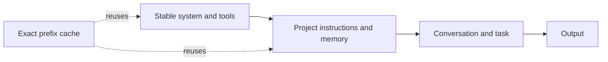
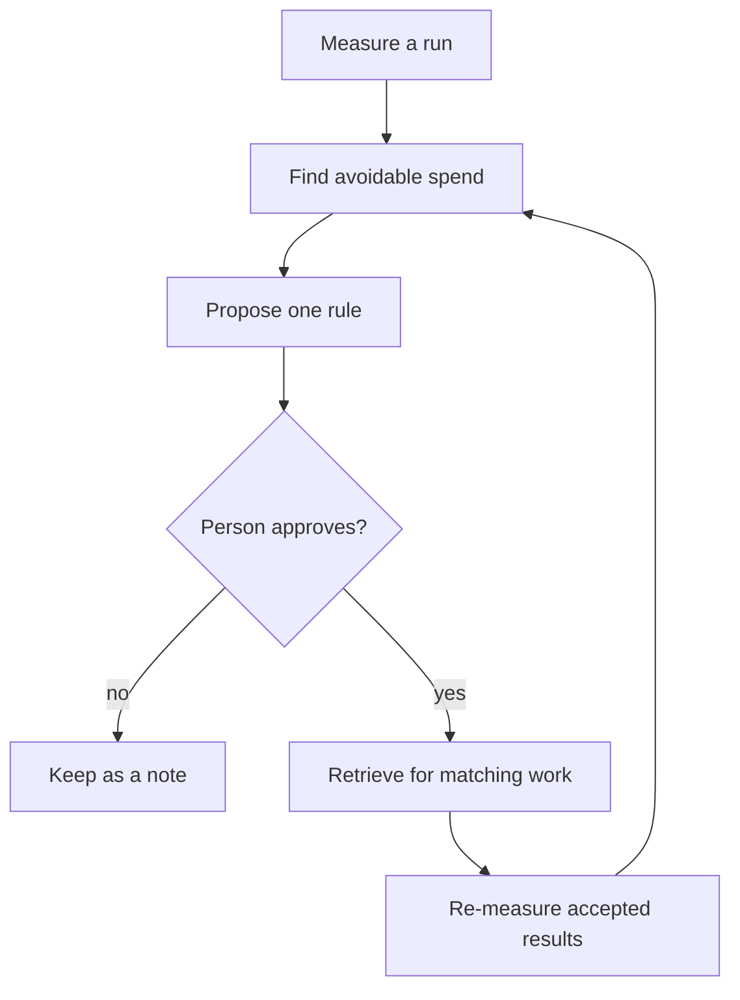

# Token optimization playbook

This guide is the small, practical version of the public reference at [github.com/khalilmaaouni/token-shield](https://github.com/khalilmaaouni/token-shield). It is host neutral. Names such as session, cache, skill and subagent describe the behavior, not a particular client.

The target is not the fewest tokens. It is the fewest tokens per accepted result. Measure before changing a habit, keep the measurement window comparable, and report NO-DATA when the host cannot expose the counters.

## The six levers

### 1. Keep the cache hot

Choose the model capability and effort at session start. Keep them stable. Batch independent tool calls into one request. Keep one outcome per session. Make configuration changes between sessions so a change is not mistaken for an active rule. Use background completion for long waits instead of waking the session on a timer.

Caching normally matches an exact prefix. A change in that prefix rebuilds the suffix. Conversation changes can leave stable system and project layers reusable, while a system or tool-definition change can rebuild the whole prefix. The exact boundary is host-specific, so verify it with the host's own usage counters.

### 2. Shrink always-loaded context

Keep the always-loaded instruction file to hard rules and short pointers. Put rationale, procedures and history in on-demand guides or durable notes. Remove unused plugins, servers, overlapping frameworks and noisy startup output. Prefer path-scoped guidance when the host supports it. Imports may organize a file without reducing its loaded size, so measure the first request rather than counting files.

### 3. Choose the session boundary by intent

Use rewind when a path should be abandoned. Use recap when orientation is enough. Use compact when the task continues but old history is dead weight. Use a fresh session for unrelated work or work that can be restated from disk. Checkpoint first: record finished work, proof, open work and decisions in a state or handover note.

### 4. Match capability to the job

Use the strongest capability for architecture, judgment, adversarial review and user-critical synthesis. Use a middle capability for scoped implementation, search and drafting. Use the cheapest capable path for mechanical bulk. A deterministic script beats a subagent for a deterministic loop. State the tier and the reason in every delegated brief. Never let the cheapest lane judge its own result.

### 5. Discipline output

Read bounded slices. Return summaries, findings and file pointers, not raw logs. Cap subagent returns. Keep the full log on disk when exact evidence matters. Text checks are cheaper than screenshots when both answer the question. Output is read again later, so verbosity is paid twice.

### 6. Prefer durable memory to re-derivation

Write decisions, invariants, failure symptoms and evidence pointers to notes. Keep a pointer in the always-loaded file, not the note body. Recall at the point of action. Promote a lesson to a global rule only after it repeats, remains stable, and is shorter than the rent it adds to every session. If memory conflicts with current evidence, current evidence wins.

## A compact cost model

For a request, think in layers:



An exact-prefix cache has a write cost, a read cost and an expiry window. The public token-shield reference documents a five minute and a one hour write option, with cache writes priced above base input and cache reads at a fraction of base input. Those ratios are provider pricing facts, not universal constants. Recheck the provider's current pricing and attach the date and host when reporting them.

The cache key can include model, effort, tool definitions and working directory. Two worktrees can miss each other's cache even when they contain the same files. Treat this as a cost model, not a promise about every host.

For a useful denominator:

```text
tokens per accepted result = input tokens + output tokens + delegated tokens
                           -----------------------------------------------
                           accepted results
```

If accepted results are unmeasured, the ratio is NO-DATA. A lower token count with more rework is not an optimization.

## Brother's routing economy

Brother defaults to inline work. Delegate only when at least one of these is true: the work is genuinely independent and parallel, the parent context needs protection, or risk needs isolation. A swarm adds fresh context, coordination and synthesis cost. Treat the documented 3x to 10x swarm cost as a planning range, not a universal measurement. It needs a written reason before dispatch.

Route by capability profile, not a hard-coded model name:

| Profile | Fit |
| --- | --- |
| Fast Worker | mechanical or low-risk bulk |
| Builder | scoped implementation from a precise brief |
| Navigator | architecture, hard debugging and tradeoffs |
| Reviewer | adversarial review and synthesis |
| Researcher | current or external evidence |
| Vision Worker | rendered output judged by inspection |

Every brief carries an objective, output shape, sources, boundaries, tier, token ceiling and runnable done check. A per-brief ceiling is a hard cap. Returns are short and structured. Independent read-only or disjoint fenced work launches in one wave. Shared-tree writers need separate fences or worktrees. The full routing law is in [delegation reference](../../products/brothermode/references/delegation.md) and the [swarm contract](../../products/brothersbe/docs/PRINCIPLES.md).

## Anti-pattern ledger

| Failure mode | Correction |
| --- | --- |
| Unbounded fleet | Set a ceiling before dispatch and stop new work near the ceiling. |
| Polling sleeps | Use background completion or a callback. |
| Cross-project enumeration | Read the current project's `PROJECT.md`. |
| Session started in a catch-all directory | Use one canonical project path. |
| Duplicate frameworks | Keep one instruction framework. |
| Mid-session config belief | Change configuration between sessions. |
| Verbose startup hook | Emit one useful line or stay quiet. |
| Tokens optimized without an acceptance denominator | Track first-pass acceptance and rework. |
| Ceiling with no sanctioned raise path | Define the human approval that may raise it. |

Historical percentages in the reference are snapshots from one machine and must not be generalized. This playbook does not claim a universal cache hit rate, startup size or swarm share.

## A self-improving loop, with a human gate

Brother already supports candidate correction learning. A worker can capture a rule, a person approves it, and later work retrieves it with its reason. See [correction learning](../../products/brothermode/docs/CORRECTION-LEARNING.md), [learn skill](../../products/brothersbe/skills/learn/SKILL.md), and `products/brothermode/tools/bm_learn.py`.

A future token loop can extend that substrate with token and swarm scope:



This is a research and design item for a later release. It is not autonomous self-improvement. The approval gate, evidence link and recheck remain mandatory.

