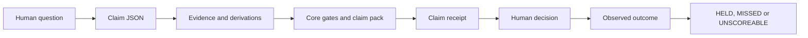

# Use BrotherDS

BrotherDS checks a claim before a person acts on a number, then records whether the later outcome held. It does not replace analysis, a dashboard, an orchestrator or the person who decides. Its unit is one claim, not the whole change.

## The path from question to reality



This is the Brother North Star chain at the claim seam. Read the [north star chain](../../products/brotherds/docs/NORTH-STAR-CHAIN.md) and [integration contract](../../products/brotherds/docs/TRIUMVIRATE-INTEGRATION.md) for the boundaries with BrotherMode and BrotherSBE.

## Start with a claim

Install Python 3.9 or newer. Install DuckDB only for SYSTEM claims:

```bash
pip install duckdb
python3 products/brotherds/bds.py selftest
```

Copy a public example and edit it for the decision. A claim needs an id, a decision-facing statement, question, decision, grain, origin, uncertainty or an explicit reason it is not established, and evidence appropriate to its origin. A SYSTEM claim also carries its source and at least two independent value derivations.

Check and render it:

```bash
python3 products/brotherds/bds.py check products/brotherds/examples/example-descriptive.json
python3 products/brotherds/bds.py receipt products/brotherds/examples/example-descriptive.json
```

The verdict is `PASS`, `FAIL` or `NO-DATA`. NO-DATA means evidence is absent. It is never a pass and never a block. Read the receipt as the decision artifact, then inspect the source evidence when the decision needs it.

## Choose the claim type explicitly

Use one of `DESCRIPTIVE`, `FORECAST`, `CAUSAL`, `MASTER_DATA`, `EXPERIMENT`, `DETECTION` or `PIPELINE`. Declaring the type prevents a causal word from sending an experiment down the wrong pack. The [BrotherDS README](../../products/brotherds/README.md) is the field-level reference.

The ten core gates ask whether the claim states its limits, origin, uncertainty, design, independent derivation, baseline, reproducibility, protocol, grain and definition. Packs add checks for experiments, detection, master data and pipelines. A gate does not run the analysis for you. It checks what the claim says happened.

## Developer persona problems

### The analyst has one impressive number

Write the decision first. Name the grain and origin. Add `not_established` before checking the value. For a SYSTEM claim, give two independent paths that compute the value. Supporting context is marked as non-computing. Run `check`, fix every FAIL, and leave NO-DATA visible when a required measurement is not available.

### The data engineer needs a safe pipeline handoff

Use the PIPELINE example as a shape. Declare freshness, volume, schema, distribution and lineage evidence. Run:

```bash
python3 products/brotherds/bds.py check products/brotherds/examples/example-pipeline-reconciled.json
```

BrotherDS checks the claim about the pipeline. BrotherSBE remains responsible for change assurance around the pipeline. Do not duplicate the sibling's change gates in a claim.

### The master data owner is told that recall is high

Do not accept a sample drawn only above the merge threshold. Derive a stratified review and include the evaluation in the claim:

```bash
python3 products/brotherds/bds.py mdm-eval review products/brotherds/examples/review-sample-mdm.csv --merge-threshold 0.8
```

The command emits a review plan that can be placed in a claim. For a matching run you provide your own results CSV and review plan, then use the `mdm-audit` commands documented in [MDM audit](../../products/brotherds/docs/MDM-AUDIT.md). The shipped, runnable master data examples are listed by [MDM science](../../products/brotherds/docs/MDM-SCIENCE.md). Copy their real inputs rather than inventing a path.

### The finance owner has forecasts but no track record

Store quantiles, the interval method and the decision they support. Score the claim when the actual arrives:

```bash
python3 products/brotherds/bds.py score claim.json 500 "finance owner" "2026-09-30"
python3 products/brotherds/bds.py ledger claims/
```

The date, actual and person in this example are placeholders. A real score needs the observed value, observer and observation date. The north star is NO-DATA until claims resolve.

### The reviewer sees a model-generated explanation

Treat the model output as triage. Arithmetic, derivation agreement, wording and outcome scoring need deterministic checks or human confirmation. Read [validation](../../products/brotherds/docs/VALIDATION.md) and the [persona journeys](../../products/brotherds/docs/PERSONA-JOURNEYS.md). A fluent explanation is not evidence.

## Receipts and outcomes

The receipt carries the claim, origin, derivations, uncertainty and limits. It is produced where analysis happens and consumed where the decision happens. Later, `score` records the observed outcome and `ledger` aggregates resolved claims. The three outcome states are HELD, MISSED and UNSCOREABLE. A missing outcome is not a success.

## BrotherDS and the Vault

BrotherDS can recall relevant local lessons when configured, but memory is advisory. Current code, current evidence and the human decision outrank it. Use [the Vault guide](use-the-vault.md) to configure retrieval and inspect its signals. A proposed lesson still needs human approval before it becomes a rule.

## Known limits

Nothing forces an analyst to write a claim. A non-empty limit field can still be lazy. Outcome scoring has no useful rate until claims resolve. Source identity uses the evidence the current implementation records, so read the receipt and current source metadata before relying on a long-lived comparison. These are declared limits, not hidden assurances.
