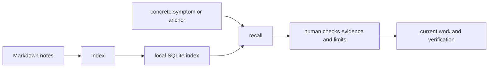

# Use the Vault

The Vault is durable local memory for lessons worth recalling at the point of work. It is not a transcript archive and it is not proof. Current repository state, current evidence and a human decision outrank recalled text.

## The retrieval path



## Configure one root

Use an existing Markdown knowledge directory or create a dedicated one outside a repository that must remain clean. Set `BM_VAULT_ROOT` in the environment that launches Brother. `BROTHERMODE_VAULT` and Brother-recorded configuration are fallback sources. An explicit `--vault` argument has highest precedence.

Do not assume the selected directory is the only source. The runtime can also read configured project memory. Inspect the reported roots and counts before using sensitive material. Local storage does not guarantee provider isolation, because recalled text may be sent to the coding host as context.

## Write for retrieval

Use the observable symptom as the title or first line. Include context, the failed or successful approach, the invariant, evidence, limits and the condition that should trigger a recheck.

```markdown
# Timeout retry can repeat an operation

Symptom: a caller sees the operation twice after a timeout.
Context: retry path; inspect the current provider semantics.
Constraint: retries preserve the same idempotency key.
Failed approach: create a new key for every attempt.
Evidence: link the current regression check.
Recheck when: provider, retry policy, or key lifetime changes.
Do not infer: every timeout means the first operation failed.
```

Keep credentials, secrets, raw customer data and unnecessary chat history out of notes. A note without evidence metadata may be surfaced as unverified. That warning is the correct result.

## Index and recall

From a Brother checkout, with `BM_VAULT_ROOT` set:

```bash
python3 products/brothermode/tools/bm_vault.py index --vault "$BM_VAULT_ROOT"
python3 products/brothermode/tools/bm_vault.py status
python3 products/brothermode/tools/bm_vault.py recall --query "timeout retry operation twice" --limit 3 --fast --explain
```

`index` writes derived local state. `status` reports the index path, note count, freshness and limitations. `recall` accepts a symptom or exact file or symbol anchor. `--fast` skips optional dense retrieval. `--explain` shows which retrieval signals ran. Current retrieval combines lexical search, anchors and linked-note expansion. Optional dense retrieval depends on local tooling and can report NO-DATA.

No results means useful context was not supplied. Reword the symptom, name a path or symbol, inspect the note directly, or refresh the index after changing notes. A match does not verify the note.

## Use recall at the point of action

Open the matched note. Check its evidence, age and applicability against current code and requirements. Record which lesson influenced the work and which current check supports using it. If the note is stale, correct or deprecate it explicitly.

At session close, commit lessons before indexing them. Indexing committed state keeps an uncommitted note from looking like an empty or failed index. Closing guidance is in [the Vault reference](../reference/vault.md) and the [correction learning guide](../../products/brothermode/docs/CORRECTION-LEARNING.md).

## Persona patterns

| Problem | Use the Vault this way |
| --- | --- |
| A maintainer repeats a known defect | Search the symptom and exact file, then verify the recalled remedy against a current test. |
| A data analyst needs a definition | Store the definition, grain and source pointer, then recheck the current claim evidence. |
| A reviewer inherits an unfamiliar project | Recall by the changed path, inspect linked notes, and keep current receipts authoritative. |
| A team wants automatic learning | Propose a candidate lesson, require human approval, then retrieve it for matching work. |

## What the Vault does not decide

It does not promote a note to truth, hide NO-DATA, or replace a receipt. A growing note count is not evidence of useful learning. To evaluate value across runs, record the lesson retrieved, whether it changed the plan, whether that change was correct and whether the known failure recurred.
