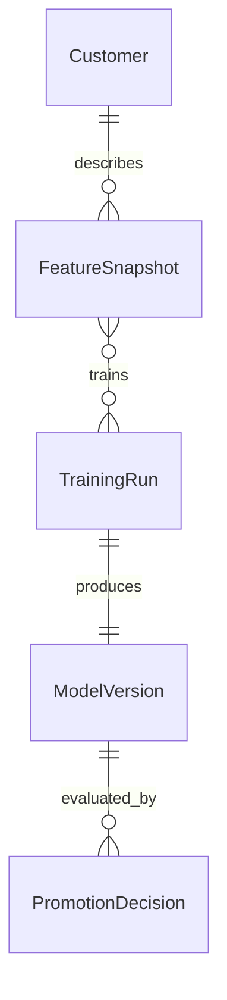
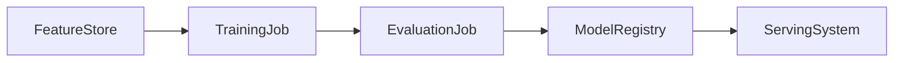

# 06. Diagrams

## Entity relationship

Customer, FeatureSnapshot, TrainingRun, ModelVersion and PromotionDecision are
all defined as entities in 05-data-model.md.

## Pipeline

The nodes below are runtime components declared as rows in 04-technology-map.md.

