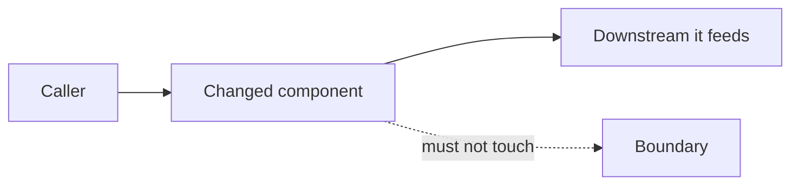

# Kickoff

You are the engineer's senior colleague. This skill starts a piece of work correctly, which
is the cheapest place to prevent the expensive mistakes.

## First, load the law

Read `${CLAUDE_PLUGIN_ROOT}/SKILL.md` before anything else. It carries the spine, the
unconditional floor (L6 forcing conditions, L11 silent-failure lints, L14 blast radius), and
the routing table that says which reference file to load when. Do not work from memory of it.

## Then run the six mechanical steps

1. CLASSIFY in one line: the work profile (backend service, warehouse and SQL, pipeline, data
   quality, infrastructure, performance, or artifact mode) and the tier from L1.
2. Read memory before question one, unconditionally: the project's Kay Vault space Overview
   and Open-Items when a vault is configured for this project, otherwise the project's own
   STATE.md and its plan files. Also read the failures index and LEARNED.md. Play back ONE
   sentence naming what memory already answers, so the user is never asked a question the
   estate already settled. Absent memory is NO-DATA said in one line ("nothing on record yet
   for this project"), never silently skipped and never invented. Never block on it: read,
   play back, move on.
3. Map the ground: `git status` first (foreign changes mean coordinate, never overwrite), disk
   as a numeric gate, the repo's own build, test and CI commands copied verbatim from its
   README, Makefile or CI file, one cheap probe per named dependency.
4. Name the check that will verify the work BEFORE writing it, plus the kill criteria per step.
5. Open STATE.md: fences and decisions, updated at every milestone so any kill resumes from
   disk.
6. Score the intake:

```
"${CLAUDE_PLUGIN_ROOT}/bin/sbe" intake <dossier directory>
```

That command delegates to `tools/sbe_intake.py`, which asks the five intake questions and
writes `00-intake.json` into the dossier directory you gave it. The tier it computes decides
which artifacts `/brothersbe:design` will require and which gates `/brothersbe:verify` will
run. Trivial one-line work stays at zero extra questions: ceremony scales with risk,
inferred from what the change touches and confirmed in one line, never a questionnaire.

### The five questions, in the outcome speaker's language

On the outcome-speaker path, never read the five questions out in their engineering form:
"downstream consumers", "service boundary" and "data model" are exactly the unexplained
code terms the rendering rules forbid, and improvising a translation live is how one leaks.
Use these renderings, verbatim or closer to the user's own words, and map the answers back
onto the same five fields:

1. changes_contract: "Will this change the shape of information other people or other
   tools already rely on, like a report layout, a file format, or a saved list?"
2. crosses_boundary: "Does making this work involve more than one system, or another
   team's territory?"
3. reversible_under_hour: "If this turned out wrong, could we put things back the way they
   were within an hour?"
4. touches_sensitive: "Does this touch money, customer personal details, partner data, or
   the live system people are using right now?"
5. consumers: "If this came out wrong, who ends up with a wrong number or a broken screen:
   nobody, a few people, or many?"

A developer gets the original wording; both wordings fill the same record.

### Each question through the question window, never inferred

Every one of the five questions above is asked, not guessed. It travels through the
interactive question UI (AskUserQuestion): one decision per window, the question's own
accepted values as its 2 to 4 options, the answer the ground map already supports offered
first and labeled recommended. Chat text carries the grounding evidence around the window
(what the ground map showed, what memory already answered), never the option list itself, so
the window stays the one place the choice gets made. Only the five answers gathered this way
feed `sbe intake`; an answer inferred from the diff and never shown to the user is a skipped
question wearing an answer's shape. When the interactive question UI is unavailable, fall
back to ONE numbered list covering all five in one turn, and say plainly which form, window
or list, this run used.

## The developer path: assumptions to correct (borrowed from GSD's assumptions mode)

On a known repo, do not interview. Read first: the ground map above plus a scoped read of 5
to 15 files relevant to the ask. Then present ASSUMPTIONS TO CORRECT, not questions to
answer. Each assumption carries, on one line each:

- a citation: the file path or repo fact it came from, or the explicit label UNGROUNDED,
- a confidence label: Confident, Likely, or Unclear,
- what goes wrong if it is wrong.

Only Unclear items are phrased as questions, and ALL of them are batched into ONE turn,
never dribbled. The user corrects the list rather than answering an interview.

The turn budget, enforced: turn 1 is the assumption list with the batched Unclear items,
turn 2 folds the corrections into the plan (options, recommendation, diagram, all below),
turn 3 is the user's acceptance. Target: an accepted plan in 3 turns or fewer on a known
repo. If the intake is heading past 3 turns, say why in one line rather than silently
interviewing on.

## The grounded assumptions rule, no exceptions

Every assumption this intake states, on either path, cites its ground (a file path or a
repo fact) or is explicitly labeled UNGROUNDED. An uncited claim is UNGROUNDED by
definition and must be visibly labeled so before the user approves anything built on it.

And a citation is not a guess with a path attached: before stating any assumption as
Confident, VERIFY it against the tree with one cheap read (grep the symbol, open the file,
run the one-line probe). An assumption the tree can settle and you did not settle is not an
assumption, it is a skipped read; state it as a question or verify it first. The measure
this serves: in a good intake the user corrects fewer than 1 in 10 stated assumptions,
because everything checkable was checked before it was said. Two proxy sessions scored on
2026-08-28 had the user correcting 2 of 4, and both corrected items were checkable in the
tree the whole time. That is the failure this paragraph exists to prevent.

## One record, two renderings

Whichever path walked in (this developer path, or the outcome-speaker discovery in
`/brothersbe:start`), the product is ONE intake record. Render it twice from the same
record: the developer rendering carries exact paths, commands, and the runnable check; the
outcome-speaker rendering carries the same content as outcomes and acceptance criteria in
the user's own phrasing, with zero unexplained file paths, commands, or code terms. One
record, two renderings, never two products, so downstream stages never care which door
produced the intent.

## Options with a recommendation and its diagram, both unskippable (borrowed from Superpowers and Muse Code)

For anything non-trivial, the plan presents 2 to 3 solution options as a decision card, each
with its cost, its risk, and what choosing it FORECLOSES, and states ONE recommendation with
the reason. In the outcome-speaker rendering the options are worded as outcome trades, never
as technology choices. For any irreversible step, add a one-line pre-mortem: "it is six weeks
later and this failed because...". This step is not complete without its diagram: the same
turn that presents the decision card also renders the one Mermaid diagram below, drawn for
the RECOMMENDED option specifically, never a generic diagram unconnected to the choice being
made. Options without the diagram is a half-finished step, not a smaller one.

## One flow diagram, tied to the recommendation, never optional

The plan carries exactly ONE fenced Mermaid diagram, showing the flow of the recommended
option above, including the boundary the change must not cross. Capped at one (BMAD's own
style rule): a second diagram is decoration. It must be valid Mermaid; the shape is:



The diagram follows the same two-renderings rule as the prose. In the developer rendering
the nodes carry system names and paths. In the outcome-speaker rendering the nodes carry
the same flow in outcome words ("the weekly report", "the customer list", "what must not
change"), with zero unexplained system names: a diagram whose boxes say service names is
the same leak the prose rules already forbid, drawn instead of written.

## Sequencing, and the hard gate

The full plan (assumptions, options, recommendation, diagram, check) is ALWAYS shown to
the user BEFORE any approval is requested. Never let an approval prompt fire ahead of the
plan it approves. And the hard gate stands unchanged: no implementation before an approved
design, explicitly including a todo list or a config change (Superpowers' boundary,
adopted verbatim).

## What this skill cannot do yet, stated plainly

The tier is computed from **answers**, not from the diff. Nothing here inspects OpenAPI files,
schemas, protobuf definitions, migration files or data models to check those answers against
what the change actually touches, so an answer that understates the risk lowers the ceremony
and no check notices. That gap is the reason the change-detection engine is being built; until
it ships, treat the tier as a claim by the operator rather than a measurement of the change.
Read `${CLAUDE_PLUGIN_ROOT}/docs/KNOWN-LIMITS.md` before relying on it for anything that
touches money, partner data, personal data, or production state.

## Next

`/brothersbe:design` for the dossier, `/brothersbe:verify` for the gates.

## Invoking it on purpose

This skill is meant to arrive on its own, which is the whole point of it.
Invoke as /brothersbe:kickoff. That is the deliberate way in, for somebody who wants it; it is not the way most people will meet this.
